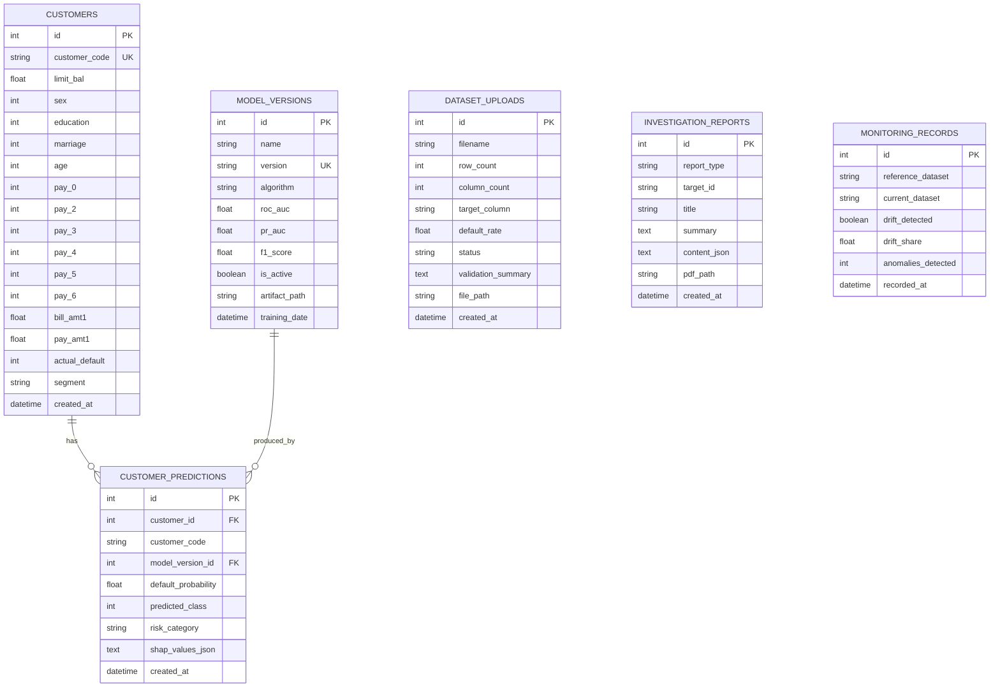

# CreditLens AI — Database Schema & Entity Relationships

```mermaid
erDiagram
    CUSTOMERS ||--o{ CUSTOMER_PREDICTIONS : has
    MODEL_VERSIONS ||--o{ CUSTOMER_PREDICTIONS : produced_by

    CUSTOMERS {
        int id PK
        string customer_code UK
        float limit_bal
        int sex
        int education
        int marriage
        int age
        int pay_0
        int pay_2
        int pay_3
        int pay_4
        int pay_5
        int pay_6
        float bill_amt1
        float pay_amt1
        int actual_default
        string segment
        datetime created_at
    }

    MODEL_VERSIONS {
        int id PK
        string name
        string version UK
        string algorithm
        float roc_auc
        float pr_auc
        float f1_score
        boolean is_active
        string artifact_path
        datetime training_date
    }

    CUSTOMER_PREDICTIONS {
        int id PK
        int customer_id FK
        string customer_code
        int model_version_id FK
        float default_probability
        int predicted_class
        string risk_category
        text shap_values_json
        datetime created_at
    }

    DATASET_UPLOADS {
        int id PK
        string filename
        int row_count
        int column_count
        string target_column
        float default_rate
        string status
        text validation_summary
        string file_path
        datetime created_at
    }

    INVESTIGATION_REPORTS {
        int id PK
        string report_type
        string target_id
        string title
        text summary
        text content_json
        string pdf_path
        datetime created_at
    }

    MONITORING_RECORDS {
        int id PK
        string reference_dataset
        string current_dataset
        boolean drift_detected
        float drift_share
        int anomalies_detected
        datetime recorded_at
    }
```
